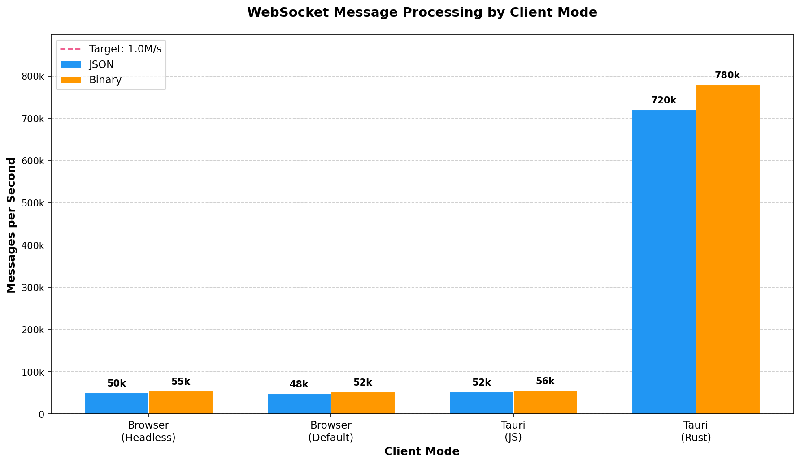

# Tauri Tick Bench

A benchmark for high-frequency WebSocket message processing — the kind needed for real-time trading UIs, live dashboards, or multiplayer games.

**The question:** Can a Tauri app handle more messages per second than a browser?

**The answer:** Yes — but only if you move WebSocket handling from JavaScript to Rust.

## How It Works

The benchmark compares three approaches to receiving WebSocket messages:

| Mode | WebSocket Handler | Message Path |
|------|-------------------|--------------|
| **browser-js** | JavaScript in browser | Server → Browser JS → React |
| **tauri-js** | JavaScript in WebView | Server → WebView JS → React |
| **tauri-rust** | Native Rust process | Server → Rust → Tauri event → React |

The key insight: **tauri-rust** handles the WebSocket connection in Rust (outside the WebView), parses messages natively, and only sends processed data to the UI via Tauri's event system. This bypasses the JavaScript event loop bottleneck entirely.

## Sample Results

At 1,000,000 msg/sec target rate with uWebSockets.js server:



| Mode | JSON | Binary | vs JS Baseline |
|------|------|--------|----------------|
| Browser (Headless) | 50k/s | 55k/s | 1x |
| Browser (Default) | 48k/s | 52k/s | 1x |
| Tauri (JS) | 52k/s | 56k/s | 1x |
| **Tauri (Rust)** | **720k/s** | **780k/s** | **14x** |

### Key Findings

- **Tauri-Rust is ~14x faster** than JS-based clients (720-780k vs 48-56k msg/sec)
- **All JS-based clients hit the same ceiling** (~50k msg/sec) — browser, headless, or Tauri WebView
- **Binary format provides only ~8-10% improvement** — the bottleneck is React's `setState()` and event loop, not JSON parsing
- **Server achieves ~1M msg/sec** with uWebSockets.js

### Server Performance

| Server Mode | Throughput | vs Baseline |
|-------------|------------|-------------|
| ws (original) | ~186k/s | 1x |
| ws (optimized) | ~212k/s | 1.1x |
| **uWebSockets.js** | **~987k/s** | **5.3x** |

See [BENCHMARK_REPORT.md](./BENCHMARK_REPORT.md) for detailed analysis.

## Prerequisites

- **Node.js** 18+ and npm
- **Rust** (via [rustup](https://rustup.rs/))
- **Tauri CLI** dependencies (see [Tauri Prerequisites](https://tauri.app/v1/guides/getting-started/prerequisites))
- **Python** 3.10+ and [uv](https://docs.astral.sh/uv/) (for chart generation only)
- **macOS** (benchmark script uses macOS-specific commands)

## Installation

```bash
# Clone the repository
git clone <repo-url>
cd tauri-tick-bench

# Install all dependencies (root, server, client)
npm install
npm install --prefix server
npm install --prefix client
```

## Running the Benchmark

### Automated Benchmark

Run the full benchmark suite comparing all three client modes:

```bash
npm run benchmark
```

Or run specific modes with options:

```bash
# Test only tauri-rust at 500k target rate for 15 seconds
npm run benchmark -- --mode tauri-rust --rate 500000 --duration 15

# Test only browser
npm run benchmark -- -m browser -r 100000

# Test both tauri modes
npm run benchmark -- -m tauri
```

**CLI Options:**

| Option | Description | Default |
|--------|-------------|---------|
| `-m, --mode <mode>` | `browser-js`, `tauri-js`, `tauri-rust`, `browser`, `tauri`, or `all` | `all` |
| `-s, --server-mode <mode>` | `ws` (Node.js ~200k/s) or `uws` (uWebSockets.js ~1M/s) | `ws` |
| `-b, --browser <mode>` | `headless` (Chromium) or `default` (your browser) | `headless` |
| `-f, --format <fmt>` | Message format: `json` or `binary` | `json` |
| `-r, --rate <n>` | Target message rate per second | `500000` |
| `-d, --duration <s>` | Test duration in seconds | `10` |

> **Tip:** Use `-s uws` to test at high throughput. The `ws` server saturates around 200k msg/sec.

The script will:
1. Start the WebSocket server
2. Run requested test mode(s)
3. Track both server actual rate and client throughput
4. Calculate efficiency (client / server)
5. Save results to `results/` folder

**Note:** Tauri tests take longer on first run due to Rust compilation.

### Generating Comparison Chart

To generate a comparison chart like the one shown above:

1. **Collect data** (runs 8 benchmarks: 4 modes × 2 formats):
   ```bash
   npx tsx scripts/collect-comparison-data.ts
   ```
   This creates `results/comparison-YYYY-MM-DD.json`.

2. **Generate chart** (requires Python 3.10+ and uv):
   ```bash
   uv run scripts/generate-chart.py results/comparison-YYYY-MM-DD.json
   ```
   This creates `results/comparison-chart.png`.

### Manual Testing

#### 1. Start the Server

**Node.js ws server** (~200k msg/sec):
```bash
npm run dev --prefix server
```
- WebSocket: ws://localhost:8080
- HTTP API: http://localhost:8081

**uWebSockets.js server** (~1M msg/sec):
```bash
npm run dev:uws --prefix server
```
- WebSocket + HTTP API: ws://localhost:8080 (combined)

#### 2. Start the Client

**Browser (JS WebSocket):**
```bash
npm run dev --prefix client
```
Open http://localhost:5173 in your browser.

**Tauri App (JS WebSocket):**
```bash
TICK_BENCH_MODE=js npm run tauri:dev --prefix client
```

**Tauri App (Rust WebSocket):**
```bash
TICK_BENCH_MODE=rust npm run tauri:dev --prefix client
```

## Configuration

### Server Configuration

The server exposes an HTTP API to adjust settings at runtime:

```bash
# Set message rate (messages per second)
curl -X POST http://localhost:8081/config -H "Content-Type: application/json" -d '{"rate": 100000}'

# Get current configuration
curl http://localhost:8081/config

# Get client stats
curl http://localhost:8081/stats

# Clear stats
curl -X DELETE http://localhost:8081/stats
```

> **Note:** For uWebSockets.js, the HTTP API is on port 8080 (same as WebSocket).

### Benchmark Script Configuration

Edit `scripts/run-benchmark.ts` to adjust:

```typescript
const CONFIG = {
  testDurationMs: 10_000,      // Test duration per mode
  stabilizationMs: 2_000,      // Wait time before measuring
  serverWsPort: 8080,          // WebSocket port
  serverHttpPort: 8081,        // HTTP API port
  clientDevPort: 5173,         // Vite dev server port
  messageRate: 500_000,        // Target messages per second
};
```

The `messageRate` is a *target*, not a guarantee. Actual throughput depends on the server implementation (see CLI options above).

## Understanding Results

The benchmark measures throughput and latency:

| Metric | Description |
|--------|-------------|
| **Msg/sec** | Messages successfully processed per second by the client |
| **Avg Latency** | Average time from server send to client receive (ms) |
| **P99 Latency** | 99th percentile latency — worst-case for 99% of messages (ms) |
| **Efficiency** | Client throughput ÷ server send rate (percentage) |

**Interpreting results:**
- **Efficiency < 100%** means the client can't keep up with the server
- **High P99 with low Avg** indicates occasional stalls (GC, event loop blocking)
- **JS clients plateau at ~50k msg/sec** regardless of server rate — this is the React/JS bottleneck

## Project Structure

```
tauri-tick-bench/
├── client/                 # Tauri + React frontend
│   ├── src/
│   │   ├── App.tsx         # Main UI component
│   │   └── hooks/
│   │       ├── useWebSocket.ts      # JS WebSocket hook
│   │       └── useRustWebSocket.ts  # Rust WebSocket hook
│   └── src-tauri/
│       └── src/
│           ├── lib.rs      # Tauri commands
│           └── websocket.rs # Rust WebSocket implementation
├── server/                 # WebSocket server
│   └── src/
│       ├── index.ts        # Entry point (selects server mode)
│       ├── ws-server.ts    # Node.js ws implementation
│       ├── uws-server.ts   # uWebSockets.js implementation
│       ├── config.ts       # Server configuration
│       └── generator.ts    # Message generator
├── scripts/
│   ├── run-benchmark.ts        # Automated benchmark runner
│   ├── collect-comparison-data.ts  # Collects data for comparison chart
│   └── generate-chart.py       # Generates comparison chart (PNG)
└── results/                # Benchmark output (JSON + charts)
```

## Troubleshooting

### Tauri build fails
Ensure Rust is installed and up to date:
```bash
rustup update
```

### Port already in use
Kill processes on the required ports:
```bash
lsof -ti :8080 | xargs kill -9
lsof -ti :8081 | xargs kill -9
lsof -ti :5173 | xargs kill -9
```

### Browser test doesn't work
The benchmark uses `open` command to open the browser. Ensure your default browser is set correctly.

### Tauri app closes too quickly
In manual mode, the app should stay open. In benchmark mode, it's intentionally closed after collecting stats.
